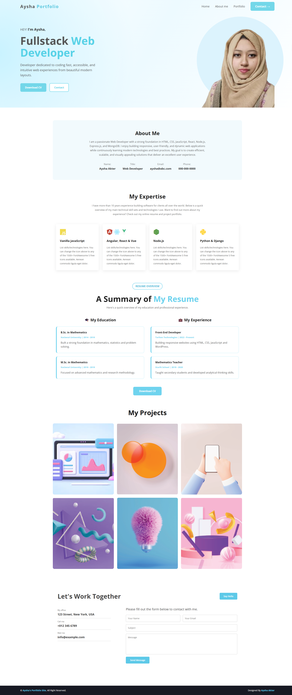

# 🌐 Personal Portfolio Website

A responsive personal portfolio website created to showcase my skills, education, experience, and projects as a Full-Stack Web Developer.

The website provides an overview of my web development journey and allows visitors to learn more about me, explore my projects, and get in touch.

## 📸 Screenshot



## 🛠️ Technologies Used

- HTML5
- CSS3
- Bootstrap
- JavaScript
- Font Awesome

## ✨ Main Features

- Responsive and user-friendly design
- Personal introduction and About Me section
- Technical skills and expertise section
- Education and experience overview
- Project showcase section
- Downloadable CV
- Contact section
- Social media links

## 📦 Dependencies

The project uses the following external libraries/resources:

- Bootstrap
- Font Awesome
- Google Fonts

## 💻 Run Locally

To run this project on your local machine:

1. Clone the repository:

```bash
git clone https://github.com/Aysha014/Portfolio-website.git
```

2. Go to the project directory:

```bash
cd Portfolio-website
```

3. Open the `index.html` file in your browser.

No additional installation is required.

## 🔗 Live Website

[View Live Website](https://aysha014.github.io/Portfolio-website/)

## 🔗 Repository

[GitHub Repository](https://github.com/Aysha014/Portfolio-website)

## 👩‍💻 Author

**Aysha Akter**

Full-Stack Web Developer
